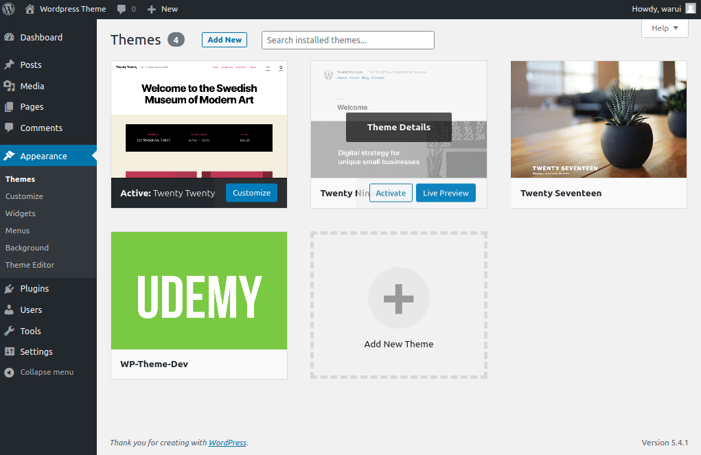

# wp-theme-dev
A fully functioning WordPress theme applying the architecture of a Wordpress core

## Requirements

APACHE/ XAMPP/ LAMPP
PHP 7+
MYSQL / MariaDB

## Development setup

Before cloning this repo:
1. Have a running WordPress site running locally or online.
2. Have Git installed.


Run Git bash or your terminal.
Goto the www for LAMPP or the htdocs directory for XAMPP
Goto YourWebsiteName/wp-content/themes/

```sh
git clone https://github.com/Warui-K/wp-theme-dev.git
```

Checkout the versioning tag [optional]

```sh
git checkout tags/v1.0.0 -b develop
```

## View the theme 
Open your browser and go to localhost/YourWebsiteName
Login as an admin localhost/YourWebsiteName/wp-admin

Go to Dashboard->Appearance->Themes on WordPress admin interface.



You can view the theme you just cloned. 


## Run
Activate the theme and go to localhost/YourWebsiteName, notice the changes in your website view.

## Release History

* 1.0.0
    * Work in progress

## Contributing

1. Fork it (<https://github.com/Warui-K/schoolica-dev.git>)
2. Create your feature branch (`git checkout -b feature/fooBar`)
3. Commit your changes (`git commit -am 'Add some fooBar'`)
4. Push to the branch (`git push origin feature/fooBar`)
5. Create a new Pull Request

## Branch Naming conventions


Branches created are named using the following format:

```
{story type}-{descriptive-branch-name}
```

`story-type` - Indicates the context of the branch and are one of:

- ft == Feature
- bg == Bug
- ch == Chore
- rf == Refactor

`descriptive-branch-name` - Short 2-3 words summary about what the branch contains


### PR Naming

The PR title should be named using the following format:

```
#[ID] Story description
```

**Example**

```
#57 Add functionas & hooks feature
```

### PR Description Template (Markdown)

The description of the PR should contain the following headings and corresponding content in Markdown format.

```md
#### What does this PR do?
#### Description of Task to be completed?
#### How should this be manually tested?
#### Any background context you want to provide?
#### What are the relevant trello cards?
#### Screenshots (if appropriate)
#### Questions:
```

### Commits

Atomic commits should be made with the format:

```
<type>(<scope>): <subject>``<BLANK LINE> <body> <BLANK LINE> <footer>

```

Any line cannot be longer than 100 characters, meaning be concise.

```<type>``` should be:

 * feature  - ft 
 * bug  - bg
 * chore - ch
 * release -rlse
 * refactor - rf
 * documentation -doc
 * style -sty
 * test -tst

```<scope>``` should be something specific to the commit change. For example:

costume
 * flight
 * fighting-style
 * fan-base
 * logo and so on.

```<subject>``` text should:

 * use present tense: "save" not "saved" or "saving"
 * not capitalize first letter i.e no "Carry to safety"
 * not end with a dot (.)

**Message body (optional)** If a body is to be written, it should:

 * written in present tense.
 * include the reason for change and difference in the previous behaviour

**Message Footer** This should be used for referencing the issues using the following keywords: Start, Delivers, Fixes and Finishes. it should be inside a square bracket. Example:

```
[Start #34]
```

or in a case of multiple issues:

```
[Finishes #65, #56, #46]
```

## Example

chore(coveralls):add coveralls yml  
[Finishes #4]

## License
MIT License

Copyright (c) 2020 Warui Kamiri